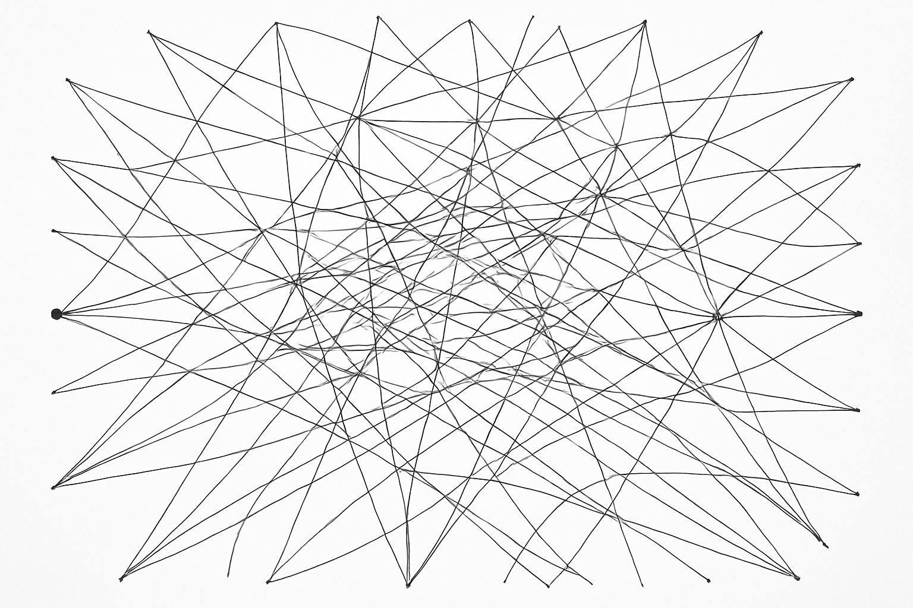

# 运动的量子化解释


未濟，亨

## 推导公式

```
n'=0
0=t
t=ab
ab=a || a ²=a
b=1 || a=1
ta=t
a=| ⟩ ​​​
tab=t(| ⟩ )²
```

## 推导过程

### n'=0

对常数n进行求导，得到0。并把n符号代换成t，得到t'=0。

t'=0 表示物质的XYZ世界是四维时空 txyz 的特殊情况。因此得到t=0。

### 0=t

$$
t=0 \Rightarrow 0=t
$$

0是时间的零点，时间是一个相对概念，每一个瞬时都在发生变化。

因此如果把时间想象成一条X轴，那么实际上这条X轴上面所有的点都是零点，只是我们目前用了公元计时去描述时间的偏移。

### t=ab

在1~n的维度中，都隐藏着时间作为“X轴”。因此三维生物观测到的二维平面，其实是t=0的三维空间。

而随着时间的流逝，持续观察得到的三维空间其实是四维时空。

因此可以归纳得出 t=ab。用时间作为n维空间两点之间长度的度量单位。

### ab=a || a ²=a

根据运动的[相对性原理](https://zh.wikipedia.org/zh-cn/%E7%9B%B8%E5%AF%B9%E6%80%A7%E5%8E%9F%E7%90%86)，
在三维空间中，一个物体的运动与否取决于所选择的参照物。

因为 a 与 b都是同等的观察者，因此得到 ab=a ，或者 a ²=a 。

ab=a也表示将距离视为一种整体。将无数的量子“合并”为算子。

### b=1 || a=1

解开方程，得到 b =1 || a=1。b=1 || a=1 表示万物都是同等的算子。

### ta=t

$$
a=1 \Rightarrow ta=t
$$

ta=t 。表示运动是基于时间的运动。不是你动，不是我动，而是心随时动。

a在这里只是纯粹的算子。

### a=| ⟩ ​​​

对算子a进行符号代换，得到 a=| ⟩ ​​​。 a=| ⟩ ​​ 表示 a 是一个量子。

### tab=t(| ⟩ )²

$$
a=| ⟩ ​​​ \Rightarrow tab=t(| ⟩ )²
$$

tab=t(| ⟩ )² 表示在n维空间中的2个量子，基于时间在做运动。



因此我们就得到了（算子）运动的量子化解释。

### tab=t(p)²

